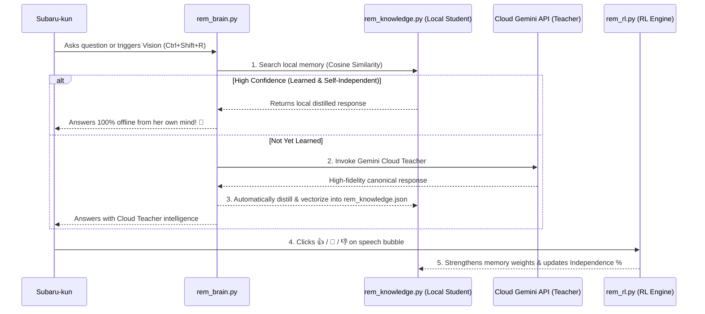

# Rem AI Companion — Complete Implementation Blueprint

## 1. Vision & Goals
A living, autonomous AI desktop companion featuring **Rem from Re:Zero** with:
1. **True Real-Time Screen Vision AI:** Sees your live screen and expresses authentic feelings.
2. **Anime Co-Watching Companion:** Recognizes anime on Crunchyroll, Netflix, YouTube, VLC, comments on characters, and perches quietly in stealth watch-party mode.
3. **Self-Evolving Mind & Knowledge Distillation:** Uses Gemini Cloud Teacher when active, automatically distills every concept into local semantic memory, and advances towards **100% offline self-independence**.
4. **Natural Reinforcement Learning (RL):** Adapts policy weights via micro-reactions (**👍, 💖, 👎**).
5. **Fluid 50 FPS Desktop Kinematics:** Walking along taskbar, hovering, dragging with physics.
6. **Two-Way Antigravity Control:** Responds to prompts without leaving your active window.

---

## 2. Learning & Evolution Pipeline

